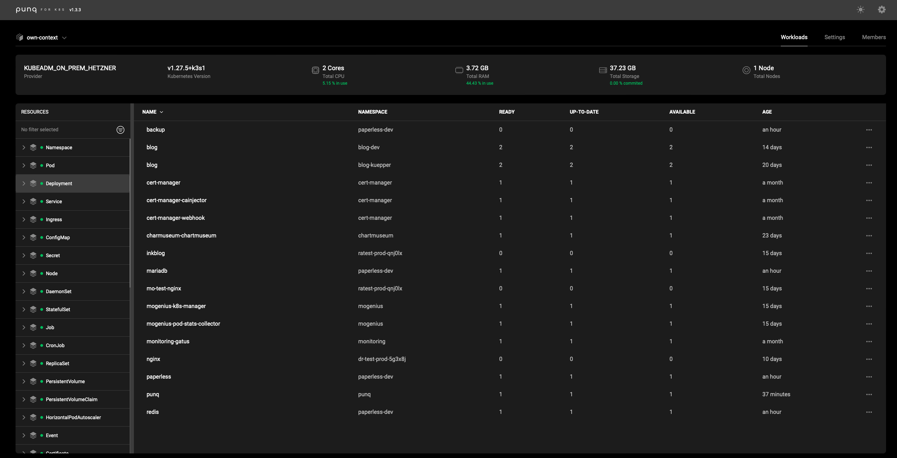

<p align="center">
  
</p>

<p align="center">
    <a href="https://github.com/mogenius/punq/blob/main/LICENSE">
        
    </a>
    <a href="https://github.com/mogenius/punq/releases/latest">
        
    </a>
    <a href="https://github.com/mogenius/punq/releases">
      
    </a>
    <a href="https://github.com/mogenius/punq">
      
    </a>
</p>
<p align="center">
    <a href="https://github.com/mogenius/punq">
      
    </a>
    <a href="https://github.com/mogenius/punq">
      
    </a>
</p>

# punq

punq provides a WebApp and CLI to easily manage multiple Kubernetes clusters. It comes with integrated team collaboration, logs, and workload editor for clusters across different infrastructures. The goal of this project is to make DevOps' lifes easier by improving Kubernetes operations especially in teams.

## How it works

punq is self-hosted on a Kubernetes cluster to run an instance for you and your team members. Each instance consists of the following services:

- The operator written in Golang
- An Angular application serving the user interface

With punq you can then manage multiple Kubernetes clusters by adding them from your local kubeconfig. The configurations are stored as secrets on your cluster and based on them punq displays all workloads and resources in the application. This way, every user of your punq instance can monitor and manage clusters without requiring access to the kubeconfig.



## Installation

The setup of punq is done via the command line interface. You can install it with the following commands.

### Mac/Linux

```
brew tap mogenius/punq
brew install punq
```

### Windows

```
Install: https://scoop.sh/
scoop bucket add mogenius https://github.com/mogenius/punq
scoop install punq
```


## Getting started

Once you installed the punq CLI here's how to get started.

```
# Install punq on your cluster in your current context. This will also set up the ingress to deliver punq on your own domain. You'll be asked to confirm with "Y". 
punq install -i punq.yourdomain.com
```
- In your domain's DNS settings, add a record for the punq domain, e.g. punq.yourdomain.com.
- Open punq in your browser.
- Log in with the admin credentials. They are prompted to your terminal once punq is installed. Make sure to store the admin credentials in a safe place, they will only be displayed once after installation.
- The cluster where punq was installed is set up per default in your punq instance. To add more clusters, use the dropdown in the top left corner and follow the instructions. Upload your kubeconfig to add more clusters. 

**🤘 You're ready to go, have fun with punq 🤘**

## Managing punq via CLI
```
# List all available CLI features
punq help
# Install the punq operator in your current kubecontext
punq install
# Manage users and permissions
punq user
# Upgrade your punq instance to the recent version
punq upgrade
# Delete punq from your current kubecontext
punq clean
```

## Development

punq has a development application that you can install with the following commands.
This version points to the branch `develop`. Please note that you can't run `punq` and `punq-dev` simultaneously on a cluster.
```
brew tap mogenius/punq-dev
brew install punq-dev
```

To update the documentation please run (in project root):
```
go install github.com/swaggo/swag/cmd/swag@latest
swag init --parseDependency --parseInternal
```

## Contribution

punq is still still early stage and we're inviting you to contribute. Feel free to pick up open issues and create PRs.


Made with 💜 by the folks from [mogenius](https://mogenius.com)
